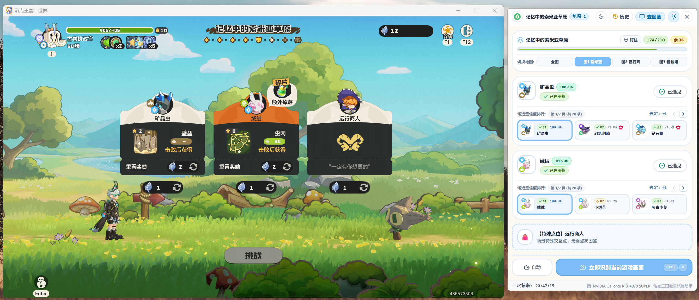
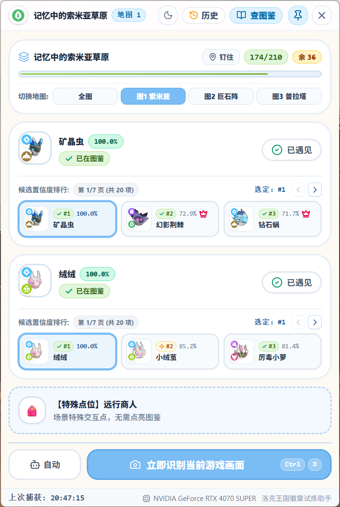
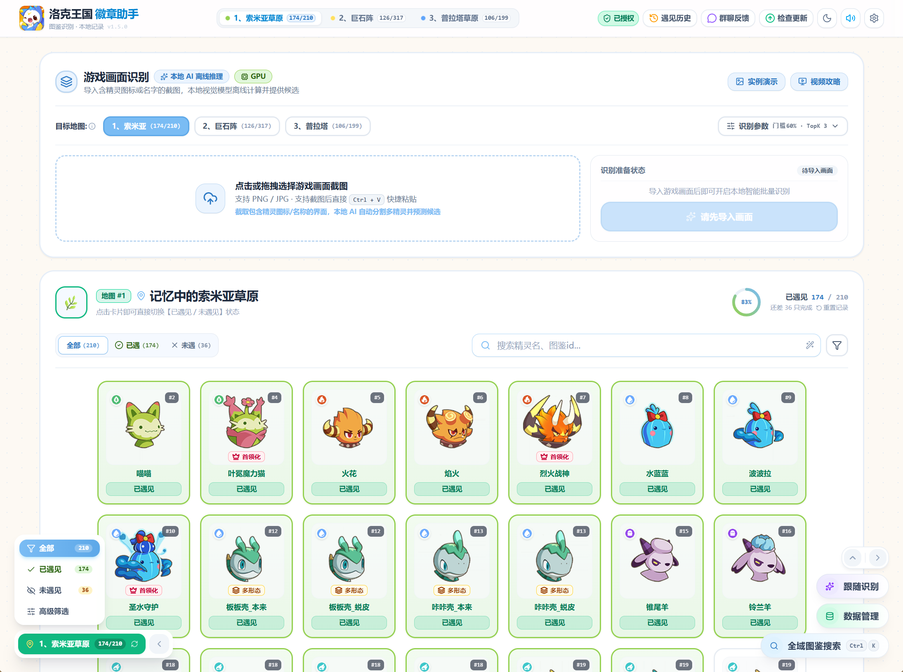
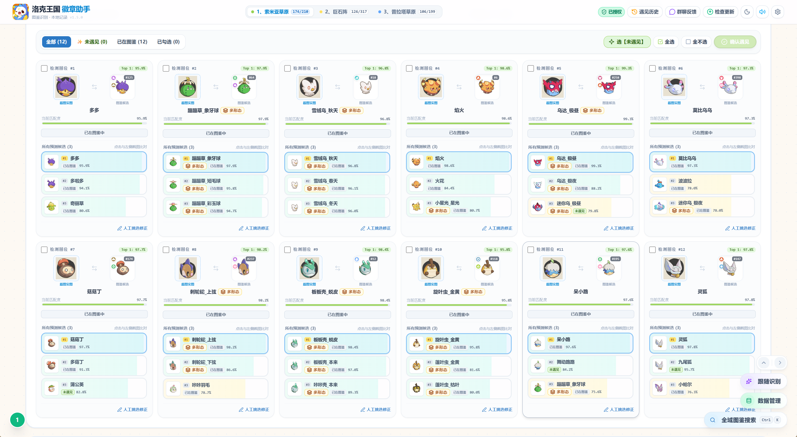
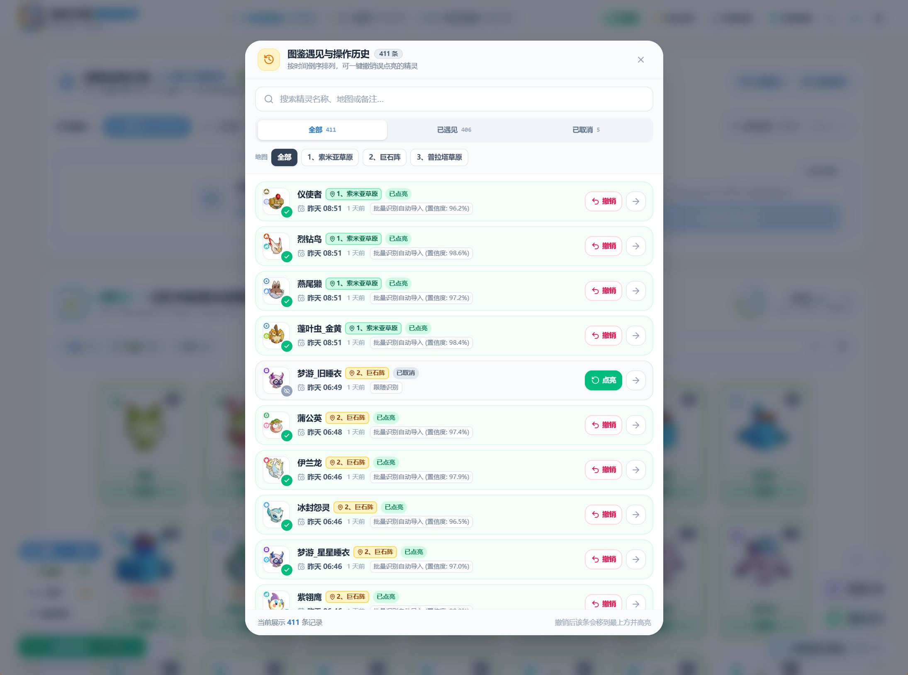
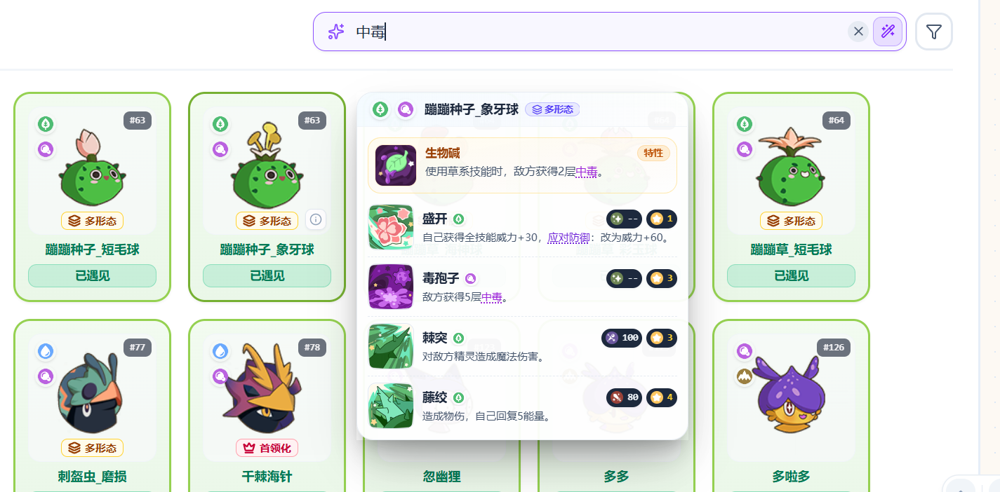

# 🎮 洛克王国徽章助手 RocoKingdomRecognizer

  <b>《洛克王国》徽章试炼 · 精灵图像识别 / 图鉴检索助手</b> 
  桌面端 + 纯前端网页版 · 本地推理 · 零内存修改 · 安全绿色

  
  &nbsp;
  
  &nbsp;
  

  
  
  
  
  
  

  
  
  

---

## 🌐 在线体验（网页版，免安装）

不想装软件？直接用浏览器打开 **<https://roco.omisheep.cn/>** —— 纯前端静态站点，
识别全部在浏览器本地完成，不上传游戏画面、也不需要登录。

---

# 洛克王国徽章试炼小助手

### 游戏跟随识别

- 游戏画面可直接识别出当前阶段和精灵槽位

- 具体样式 & 特殊点位识别：

## 主页面同步展示

## 初始化识别对比

## 历史记录

## 技能搜索

# 下载

> 下面的链接**始终指向最新版本**，直接点进去就能看到当前最新版，不需要自己找版本号。

1. 【**最省事**】网页版，打开即用：[**roco.omisheep.cn**](https://roco.omisheep.cn/)（免安装，浏览器本地识别）
2. 【**推荐**】下载安装程序 `RocoKingdomRecognizer_Setup`：[GitHub Releases（最新版）](https://github.com/iozxc/rocokingdom_recognizer/releases/latest)
3. 下载免安装分卷压缩包：[Gitee Releases（最新版）](https://gitee.com/iozxc/rocokingdom_recognizer/releases/latest)

- 由于仓库限制，Gitee 的分卷（`RocoKingdomRecognizer_part.7z.001` 起）需要全部下载后一起选中再解压
- 也可以直接加群下载：`723155657`

# 🌟 项目简介

**RocoKingdomRecognizer** 是一款面向《洛克王国》图像识别与深度学习领域的技术演示作品。通过深度学习技术，演示自动识别精灵、场景及关键信息，并结合流畅的桌面端交互，探索视觉识别技术在图鉴检索场景的应用。

> **提示：** 本作品仅用于学习与技术交流，不涉及任何游戏内存修改，安全绿色。

---

# 🛠️ 技术栈

识别链路：窗口截图 → 版面检测 → 文字识别 / 特征检索 → 结果融合。

| 模块 | 技术 |
|:---|:---|
| 前端 | React + TypeScript + Vite + Tailwind CSS |
| 后端 | Flask + Waitress（本机服务） |
| 桌面端 | pywebview（主界面 + 跟随识别悬浮窗） |
| AI 识别 | YOLOv8 版面检测 + PP-OCRv4 文字识别 + ResNet50 特征检索，ONNX Runtime 推理 |
| 训练框架 | PyTorch + Ultralytics，模型统一导出 ONNX |
| 数据存储 | SQLite（图鉴库）+ JSON（用户数据） |
| 打包分发 | PyInstaller + Inno Setup |

---

# 📱 联系我们 & 反馈

如果你在使用过程中遇到 Bug，或者有精灵图鉴需要纠错，欢迎加入交流群：

- **QQ 交流群**：`723155657`
- **在线反馈**：已集成在 App 内部
- **Gitee Issue**：[点击提交反馈](https://gitee.com/iozxc/rocokingdom_recognizer/issues)

---

# 📥 安装与运行

1. 前往 [Releases（GitHub，最新版）](https://github.com/iozxc/rocokingdom_recognizer/releases/latest) 页面下载。
2. 前往 [Releases（国内 Gitee，最新版）](https://gitee.com/iozxc/rocokingdom_recognizer/releases/latest) 页面下载。
3. 运行安装程序，按照指引完成安装。
4. 桌面双击 **RocoKingdomRecognizer** 即可启动。

> 版本更新内容见 [CHANGELOG.md](CHANGELOG.md)，用户数据保存在 `roco_user_data.json`，覆盖安装或卸载都不会被删除。

---

# 🤝 参与贡献

如果你也想为洛克王国生态出一份力：

1. **Star** 本项目（这对我们非常重要！）。
2. 提交 Pull Request 修复 Bug 或增加新功能。
3. 帮助完善精灵识别模型的数据集。

---

# 📄 开源协议

本项目基于 [MIT License](LICENSE) 协议开源。

---

 
  如果这个项目帮到了你，请给一个 ⭐️ Star 吧！ 

