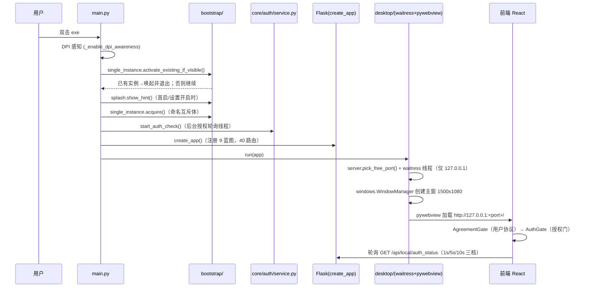
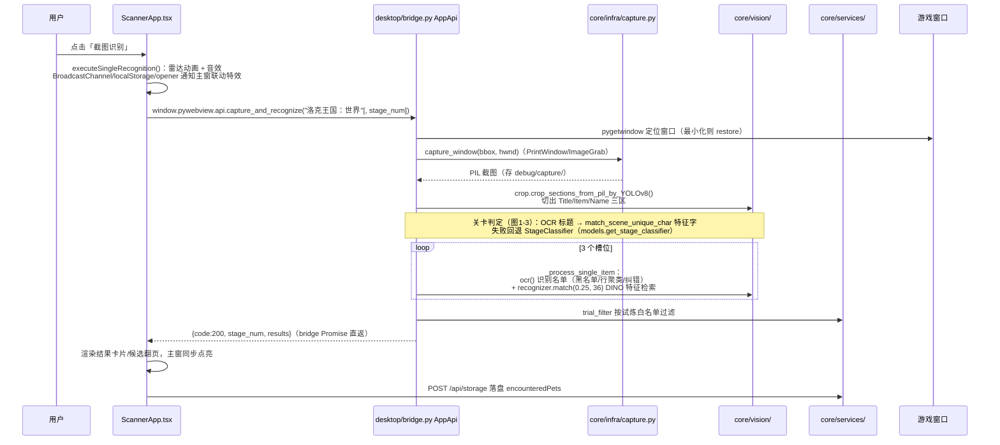
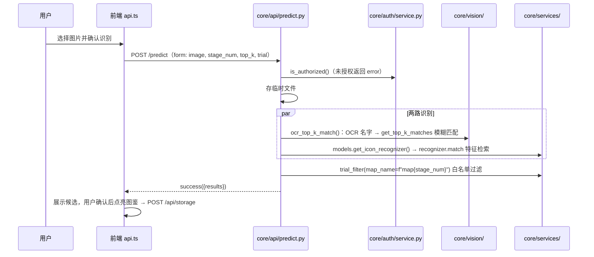
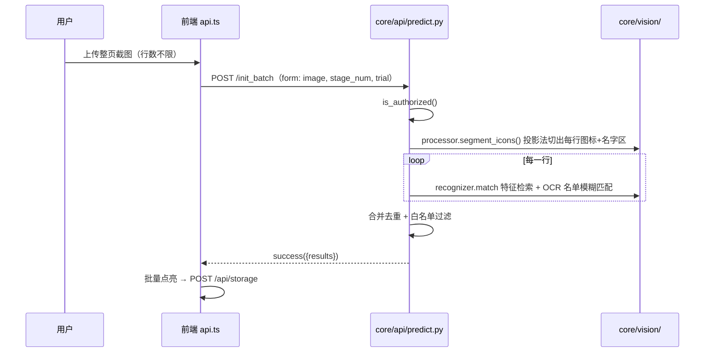
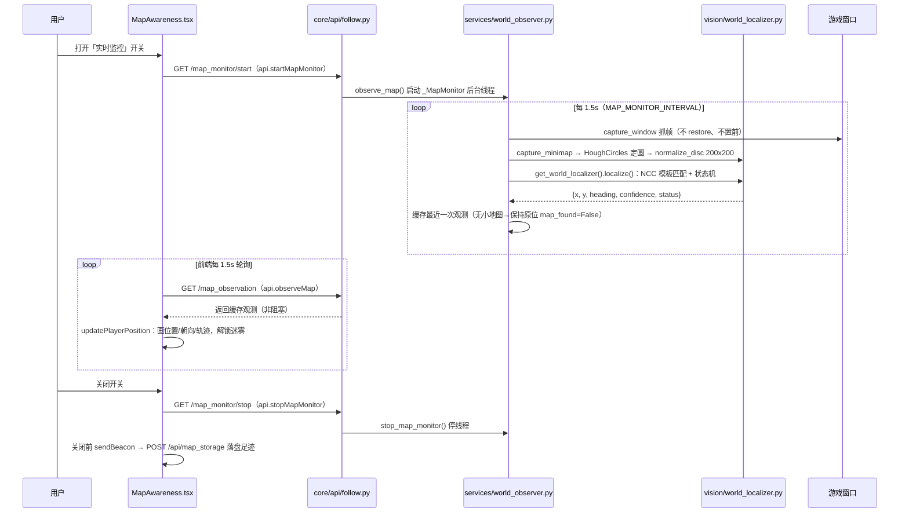

# 调用链全景（Call Flows）

_2026-09-01 依据当前代码逐行核实整理。每个流程给出：用户操作 → 前端事件 → 通信通道 → 后端处理 → 结果回显/落盘，全部可对照文件与函数名验证。_

## 目录

1. [应用启动链路](#1-应用启动链路)
2. [跟随识别：悬浮窗「截图识别」按钮（徽章试炼）](#2-跟随识别悬浮窗截图识别按钮徽章试炼)
3. [首页单个识别：上传图片（POST /predict）](#3-首页单个识别上传图片post-predict)
4. [批量初始化：冒险日志截图（POST /init_batch）](#4-批量初始化冒险日志截图post-init_batch)
5. [地图感知：开启/关闭实时监控（开放世界大地图识别）](#5-地图感知开启关闭实时监控开放世界大地图识别)

> 术语：流程 2-4 属于【徽章试炼】关卡判定与精灵识别；流程 5 属于【地图感知】开放世界大地图识别。两者互不相干。

---

## 1. 应用启动链路

双击 `RocoKingdomRecognizer.exe`（开发环境 `python main.py`）。

关键点：
- `main.py` 的打印分隔符必须最先输出，因为 `desktop` 包导入会触发模型/用户数据加载（`core/infra/capture.py` 模块级 `user_storage.load()`）。
- 授权失败不阻塞 UI，前端 `featureLock.ts` 锁定识别功能。

---

## 2. 跟随识别：悬浮窗「截图识别」按钮（徽章试炼）

**触发**：用户在「精灵识别跟随」悬浮窗（`ScannerApp.tsx`，`/?view=scanner`）点击识别按钮。

要点：
- 结果**不经过 HTTP**，由 pywebview bridge 的 Promise 直接返回前端；落盘走 `POST /api/storage`（版本号协商，毫秒时间戳）。
- 「重新识别（指定关卡）」走 `capture_and_recognize_by_map(stage_num)`，跳过关卡判定直接按钉住关卡识别（`ScannerApp.tsx:740-747`）。
- 悬浮窗的打开：主页按钮 → `followScanner.ts` → `pyApi.open_scanner_to_app()`（bridge）→ `WindowManager` 创建/显示 500×650 无边框置顶窗。

---

## 3. 首页单个识别：上传图片（POST /predict）

**触发**：主页「单个精灵识别」弹窗（`SinglePetRecognizerModal`）上传截图/图片。

## 4. 批量初始化：冒险日志截图（POST /init_batch）

**触发**：主页「批量初始化」弹窗（`BatchInitModal`）上传冒险日志整页截图。

> 注：流程 3/4 失败时前端有离线 mock 兜底（`api.ts` 内 `predictPet`/`initBatch` 的 catch 分支，见「风险」一节）；生产环境注意甄别。

---

## 5. 地图感知：开启/关闭实时监控（开放世界大地图识别）

**触发**：主页「地图感知」工具（`MapAwareness.tsx`）打开实时监控开关。

要点：
- 全程**与试炼无关**：不读 `config.TRIALS`、不做标题 OCR、不写 `encounteredPets`；足迹写入独立的 `roco_user_mapdata.json`（`/api/map_storage`）。
- 识别在后台线程进行，HTTP 请求只读缓存，因此 1.5s 轮询不会卡顿。

---

## 附：两条通信通道速查

| 通道 | 用途 | 方向 |
| --- | --- | --- |
| pywebview bridge（`window.pywebview.api.*`） | 窗口控制、跟随识别截图（流程 2） | 前端 ↔ `desktop/bridge.py AppApi`，Promise 直返 |
| HTTP REST（axios，动态端口仅 127.0.0.1） | 单图/批量识别、存储、地图感知、授权、更新（流程 3-5） | 前端 ↔ `core/api/` 9 蓝图 |
