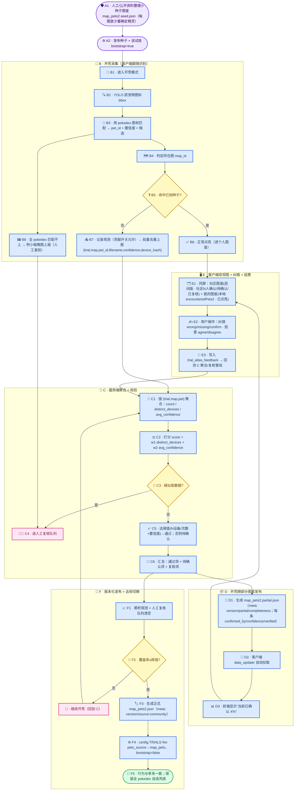

# 火系徽章试炼「开荒图鉴」设计方案

## 一、背景与现状

- 现有**草系徽章试炼**：`config.TRIALS` 里 `grass` 有 `pets_source: "map_pets"` 与
  `map_pets_json_list = datasets/map_pets1.json`，即已知「哪个试炼的哪张图里有哪些精灵」。
  `core/icon_names.load_map_pets()` + `sprite_to_file()` 靠这份 JSON 把识别到的精灵名反查成数据集文件名。
- **火系徽章试炼**（`config.TRIALS` 的 `fire`）：目前 `pets_source: "pokedex"`（全图鉴自选），
  `map_pets_json_list` 指向 `datasets/map_pets2.json`，但**文件尚不存在**——因为官方未公开各图的精灵名单。
- 前端已有 `getTrials()` / `activeTrialKey` / `getIcons()` 的试炼体系；跟随识别用 YOLO 抓取精灵图标 + 图标匹配。
- 远程服务器（`RocoKingdom_Server`）已有：授权表、用量/在线表（含 `platform`）、CORS、IP 记录。

## 二、问题定义

已知：
- 全图鉴 `roco_all_pets_info.json`（所有宠物的 id/名称/元素）是**完整的、已知的**。
- `datasets.db` 里所有宠物的图标 BLOB 都在（icon 名称即文件名）。**我们能对任意截图里的图标做“识别到哪只宠物”。**

未知（要开荒的目标）：
- 火系试炼的**每张图里实际会出现哪些精灵**（即 `map_pets2.json` 的内容），以及大致出现频率。

因此我们要做的是：**在“完整图鉴 JSON 不存在”的前提下，通过玩家真实游玩 + 识别，把这份 JSON 众包地“填”出来，
并保证质量、可治理、可平滑过渡到和草系一致的正常逻辑。**

## 三、设计原则

1. **以“识别出的宠物 id + 所在图 + 置信度”为核心数据，而不是原始图片。**
   因为我们已知全部图标与 pokedex，识别即可得出 `pet_id`；**无需上传图片**（减带宽、减隐私/版权风险）。
2. **众包 + 人工复核（Human-in-the-loop / Active Learning）。** 机器出候选，人（运营/玩家）确认，逐步扩数据集。
3. **置信度加权 + 去重 + 阈值。** 用“多少个不同玩家报告过 + 平均置信度”给候选打分，抗数据噪声。
4. **版本化发布 + 渐进切换。** 图鉴分版本（种子/草稿/社区版/稳定版），客户端随版本更新，覆盖率达标后切回正常逻辑。
5. **带开关（Feature flag）的开荒模式。** 每个试炼一个 `bootstrap` 模式：没有完整图鉴时启用；达标后关闭，行为与草系一致。
6. **隐私默认。** 数据上传需要用户同意；设备用哈希 id；默认只传元数据不传原图；可一键关闭。

## 四、推荐方案：社区图鉴开荒系统（分四阶段）

### 阶段 1：种子（Seed）
- 先人工/外部资料整理一份**很小的种子图鉴**：每张图只放“你确定会出现”的少数精灵（哪怕 5~10%）。
- 作用：让开荒期的候选空间和置信度计算更稳；不是必须，但能显著提升收敛速度。
- 若实在没有，可跳过，直接用“全 pokedex 兜底”作为候选集（当前 fire 就是这样）。

### 阶段 2：开荒采集（客户端）
- 给火系试炼加 `bootstrap` 标志（`map_pets2.json` 不存在 / `config` 里该试炼 `pets_source` 仍是 `pokedex` 或加 `bootstrap: true`）。
- 跟随识别进入**开荒模式**：
  1. YOLO 抓宠物图标 bbox。
  2. 用**现有 pokedex 图标匹配**识别出 `pet_id / 文件名 + 置信度 + 候选`。
  3. 判定所在图（复用现有试炼关卡识别：关卡标题 OCR + 特征字 / 标题图像分类），得到 `map_id`。
  4. **只上报元数据**：`{ trial_key, map_id, pet_id, filename, confidence, client_version, device_hash }`，
     不传原图（只有遇到“全 pokedex 都匹配不上”的未知精灵时才可附带一张小缩略图，用于人工查验）。
  5. 上报策略：**低频批量 + 去重**（同一 `(map, pet)` 会话内只报一次；攒 N 条或每 M 分钟、或会话结束时批量 POST）。
  6. 前端加入“贡献开荒数据”开关（默认开但可关），并说明只传“识别到的精灵+图+置信度”，不含截图/可识别个人身份。
- 说明：相比“传图片再服务端识别”，这里**在端上就完成了识别**，服务端只需聚合，数据量小、质量高、更合规。

### 阶段 3：聚合与校验（服务端 + 管理后台）
- 新表 `trial_observations`，按 `(trial_key, map_id, pet_id)` 聚合：
  - `observation_count`、`distinct_devices`、`sum_confidence`、`first_seen_at`、`last_seen_at`。
- 打分：`score = w1 * distinct_devices + w2 * avg_confidence`（不同设备数权重高，防止单用户刷）。
- 校验/反作弊：
  - 需要 ≥ N 个不同设备 或 ≥ M 次上报 才进入候选；
  - `avg_confidence` 低于阈值则降级；
  - 同设备去重；
  - 异常：某宠在很多毫不相关的图里低置信度出现 → 标记“疑似脏数据”进人工队列；
  - 按设备/IP 限流。
- 管理后台加一个**「图鉴开荒」页**：
  - 按图浏览候选（按 score 排序）、筛选（置信度/设备数/状态）；
  - 支持“采纳 / 忽略 / 待人工确认”；
  - 一键**导出为 `map_pets2.json`**（带版本号与来源 `source: community`、置信度元信息）。
- **人工复核**是质量兜底：运营只需处理分数临界或可疑项，大头走阈值自动通过。

### 阶段 4：版本化发布 + 平滑切换
- 发布的 `map_pets2.json` 带 `meta: { version, source: "community"|"official", generated_at, confidence }`。
- 客户端沿用现有 `data_updater` 自动拉取更新。
- 当某图的覆盖率达到阈值（如该图精灵绝大多数已被确认），把该试炼切成 `pets_source: "map_pets"` 并关闭 `bootstrap`，行为与草系完全一致。
- **兜底策略**：即使图鉴不完整，也保留“全 pokedex 自选”作为候选回退，用户不会因缺图反而无法用。

## 四·补充：开荒期“同时能看到部分图鉴 + 自己点亮图鉴”并纠错

开荒阶段**不等图鉴完整**，也要**周期性发布“部分图鉴（社区版）”**，让用户知道 App 现状，也方便及时纠错。

**1. 部分图鉴持续发布**
- 服务端每跑一轮聚合，就生成一个**部分版** `map_pets2.partial.json`（带 `meta`）：
  ```json
  {
    "meta": { "version": "v0.3", "source": "community", "partial": true,
              "completeness": 0.47, "generated_at": "2026-09-01T12:00Z" },
    "map1": { "004_叶冕魔力猫.png": { "id": 4, "confirmed_by": 18, "confidence": 0.93 }, ... },
    "map2": { ... },
    "map3": { ... }
  }
  ```
- 每个条目带 `confirmed_by`（多少不同设备确认）、`confidence`（平均置信度）、可选 `verified`（是否人工复核过）。
- 客户端用现有 `data_updater` 拉取，展示“当前已确认 X%”。

**2. 客户端双视图（同时看，不互斥）**
- **社区图鉴（民间版）**：来自上面发布的部分图鉴，标 `社区 N 人确认` / `待确认` / `已复核`。
- **我的图鉴（自己点亮的）**：来自本地 `encounteredPets2`（该试炼的 collection_key），即玩家自己游戏内开图鉴的记录，标“已点亮”。
- 图鉴页同时展示两者：同一张卡上同时出现“我已点亮”和“社区 N 人确认”两种徽标，互不覆盖。
- 也提供 Tab 或筛选：只看“社区已确认” / “我已点亮” / “全部（含未确认候选）”。
- 未确认候选可灰度显示（低饱和度），提示“待社区确认”。

**3. 用户纠错/补充（不只靠自动跟随识别）**
- 每张卡 / 每张图提供“纠错 / 缺漏”入口：
  - “这只不该在这个图里” → `type: wrong`；
  - “这只我在这张图遇到过，图里没列” → `type: missing`（可选带上该宠）；
  - “确认这只” → `type: confirm`（一键提升置信度）。
- **每条社区图鉴还可投票**：`赞同`（`type: agree`，计入该条 `confirmed_by` / 加权）或
  `不赞同`（`type: disagree`，进入人工复核队列，防止社区图鉴“以讹传讹”）。
- 服务端新表 `trial_atlas_feedback` 存这些纠错与投票，进入**与观测同一条聚合/人工复核管线**。

## 五、数据模型与接口（建议）

### 服务端表
```sql
CREATE TABLE IF NOT EXISTS trial_observations (
  id INTEGER PRIMARY KEY AUTOINCREMENT,
  trial_key TEXT NOT NULL,        -- 'fire'
  map_id TEXT NOT NULL,           -- 'map1'/'map2'/'map3'
  pet_id INTEGER NOT NULL,
  filename TEXT,                  -- 数据集文件名（可反查图标）
  confidence REAL,
  device_hash TEXT,               -- 设备哈希（匿名）
  platform TEXT DEFAULT 'app',
  client_version TEXT,
  created_at TEXT
);
CREATE INDEX IF NOT EXISTS idx_obs_agg ON trial_observations(trial_key, map_id, pet_id);
```

```sql
CREATE TABLE IF NOT EXISTS trial_atlas_feedback (
  id INTEGER PRIMARY KEY AUTOINCREMENT,
  trial_key TEXT NOT NULL,        -- 'fire'
  map_id TEXT NOT NULL,           -- 'map1'/'map2'/'map3'
  pet_id INTEGER,                 -- 可为空（missing 时用户填）
  filename TEXT,
  type TEXT NOT NULL,             -- 'wrong' | 'missing' | 'confirm' | 'agree' | 'disagree'
  device_hash TEXT,
  client_version TEXT,
  created_at TEXT
);
```

### 接口
- `POST /api/trials/<trial_key>/observations`（批量，开荒上报）
- `GET  /api/trials/<trial_key>/atlas/candidates`（管理后台：聚合候选）
- `POST /api/trials/<trial_key>/atlas/review`（管理后台：采纳/忽略）
- `GET  /api/trials/<trial_key>/atlas`（客户端可拉取的“已发布社区图鉴”，带版本与来源）
- `POST /api/trials/<trial_key>/atlas/feedback`（用户纠错：wrong / missing / confirm）
- 复用现有授权/限流/CORS；建议对上报接口做设备级限流与幂等（同一批次重复上报不重复计数）。

## 六、质量与反作弊
- 不同设备数去重 + 置信度阈值。
- 疑似伪造：同宠跨大量地图低置信度、单设备刷量 → 自动降级/进人工。
- 后台人工复核队列。
- 版本号回滚：若某版社区图鉴被质疑，可回退到上一版。

## 七、隐私与合规
- 上线前在 App 内明示“贡献开荒数据”用途（只传识别结果与置信度，不传截图/原图，设备匿名）。
- 用户可随时关闭；关闭则不上报。
- 建议不存储原始截图；若必须存（未知宠），存极小缩略图并加密/尽快清理。
- 留意游戏素材版权：只传“文件名/ID”等元数据，尽量减少对图片的再分发。

## 八、激励与运营
- 「图鉴开荒者」榜单：按贡献量（去重后新增候选数）排名。
- 贡献者可**提前解锁社区图鉴预览**，或获积分/称号。
- 对“首个在某图确认某宠”的玩家给标识（first discoverer）。

## 九、方案对比（优缺点）

### 方案 A1：纯众包收集（你想法 1+2 的原始版）
- 上传：YOLO 抓的图片 + 文件名 + 关联地图（客户端**不识别**）。
- 流程：空图鉴 → 用户填 → 服务端聚合排序 top-N → 发布。
- ✅ 最贴合你的直觉；实现简单；数据全部来自真实游玩；无需端上识别。
- ❌ **没有 pet_id**：图标/文件名不识别就无法聚合“同一只宠”，服务端还得再跑识别（重）；需要用户手动标名；脏数据/刷量风险高；上传图片有带宽和版权/隐私问题；收敛慢。

### 方案 A2：端上识别后再上报（推荐核心，是对 A1 的升级）
- 上传：`pet_id/filename + map_id + confidence`（不传图）。
- ✅ 直接拿到 pet_id；复用现有识别；数据量小、质量高、隐私好；聚合直接。
- ❌ 依赖端上识别质量（火系截图背景不同可能略差，需置信度阈值）；长尾/未知宠仍需人工。

### 方案 B：读取游戏官方图鉴（OCR 解锁事件）
- 检测玩家在游戏内打开“图鉴”页，OCR 每只精灵归属的图，上报“解锁事件”。
- ✅ 数据最贴近官方真值；天然带“宠物-图”归属。
- ❌ 需 OCR 游戏 UI，脆弱（版本更新/UI 变化/反作弊）；需玩家主动进该页；截取游戏画面敏感度高；覆盖面取决于玩家行为。

### 方案 C：纯人工众包标注（Human-in-the-loop 兜底）
- 社区/玩家手动标注“某图看到了某宠”，采纳后进图鉴。
- ✅ 质量最高；可覆盖机器难识别的长尾；可控。
- ❌ 需要人力和时间；非全自动；依赖社区活跃度。

### 方案 D：种子 + 识别上报 + 置信度聚合 + 阈值/人工阈值复核 + 版本发布（推荐，主流 Active Learning 落地）
- 小种子 → 端上识别上报 → 服务端去重打分 → 阈值自动通过 + 临界项人工复核 → 版本化发布 → 达标切正常。
- ✅ 平衡质量/速度/人工成本；符合“Human-in-the-loop + 版本化数据”的主流做法；能梯度上线。
- ❌ 组件多（识别、聚合作业、后台管理、版本发布），前期要实现的东西多一些。

### 方案 E：联邦/边缘聚合（极致隐私，通常不必要）
- 客户端本地聚合计数，只上传“各图各类的计数”或差分隐私噪声。
- ✅ 隐私极强；带宽最小。
- ❌ 实现复杂；拿不到原始样本用于复核/发现新宠；对本场景属于过度设计。

## 十、落地顺序（Roadmap）
1. 服务端：建 `trial_observations` 表 + 批量上报/聚合/候选/采纳接口 + 后台「图鉴开荒」页。
2. 客户端：火系试炼加 `bootstrap` 标志；跟随识别开荒模式（端上识别出 pet_id + map + 置信度，开关控制批量上报）。
3. 后台：先人工做一份小种子；跑一段时间的聚合，人工复核临界项。
4. 发布 `map_pets2.json`（带版本/来源），客户端自动更新。
5. 覆盖率达标后：`config.TRIALS` 把 fire 的 `pets_source` 切成 `map_pets`、去掉 bootstrap，行为与草系一致。

## 十一、风险与开放问题
- 识别在“开荒期”候选是全 pokedex，可能会误判；用 `top-k` + 置信度 + 人工复核兜底。
- 玩家会不会愿意开数据上报？-> 给激励 + 明示隐私 + 默认可关。
- 长尾精灵（极少玩家遇到）收敛慢 -> 可结合方案 B（官方图鉴 OCR）补长尾，或长期人工征集。
- “社区图鉴”标注（民间版）要在客户端 UI 上区分，避免被当成官方。
- 需不需要上传图片：默认不，只有“未知宠”才附带小缩略图进人工队列。

## 附·整体流程图（方案 D + 开荒期补充）

> 图例：A 种子 → B 开荒采集 → C 聚合校验 → D 部分图鉴发布 → E 客户端双视图+纠错+投票 → F 版本化发布+达标切换。
> 虚线表示“开荒期持续循环”；达标后走 F 进入与草系一致的正规流程。



### 步骤字母速览

| 字母 | 阶段 | 关键动作 |
| --- | --- | --- |
| A | 种子 | 小种子图鉴 + 开启 bootstrap |
| B | 开荒采集 | 端上识别 pet_id/置信度/所在图；命中即点亮，否则批量上报；未知宠附缩略图 |
| C | 聚合校验 | 去重、打分、脏数据人工复核、阈值通过/待确认 |
| D | 部分图鉴发布 | 周期性 `map_pets2.partial.json`（版本/完成度/confirmed_by），客户端自动拉取 |
| E | 双视图+纠错+投票 | 社区图鉴 × 我的图鉴 同屏；wrong/missing/confirm；agree/disagree 投票回流 |
| F | 版本化+达标切换 | 覆盖率达阈值 → 正式 `map_pets2.json` → `pets_source→map_pets`、关闭 bootstrap，与草系一致 |
